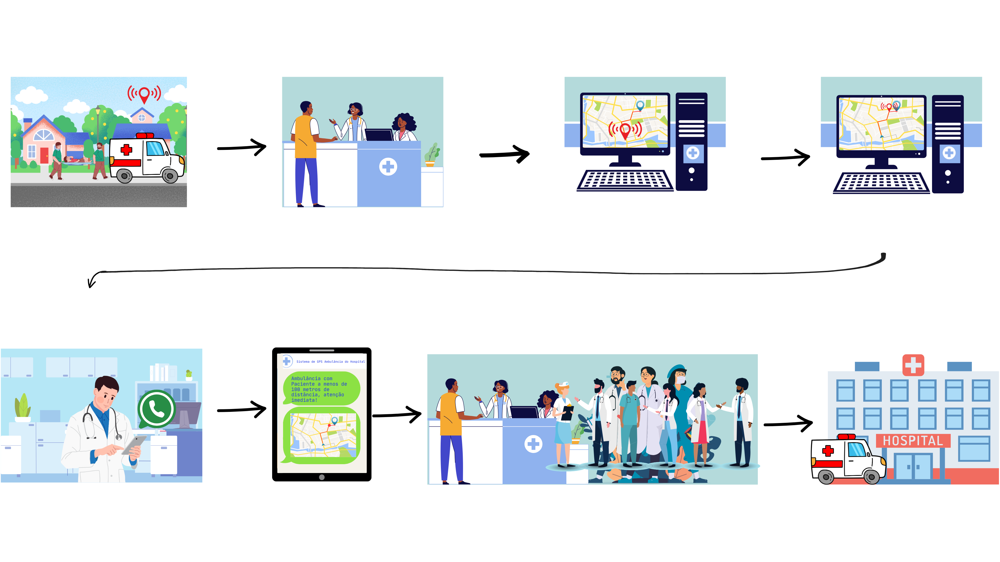
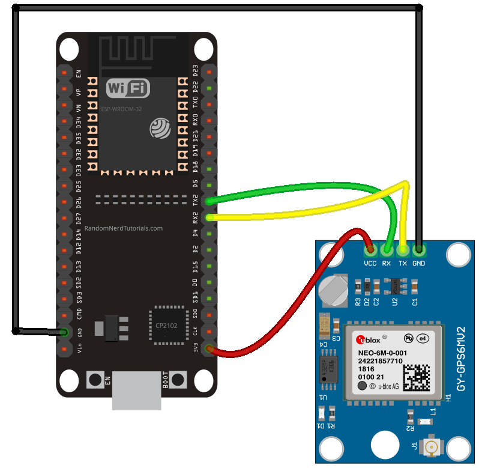

# Maloca das iCoisas - Hands On Avançado - Desafio K1

Projeto realizado no curso Maloca das iCoisas, módulo avançado, pelo grupo 4 - Os Suricatos Cibernéticos.

Rastreamento de Ambulância em tempo real usando o Glith e o Módulo GPS NEO-6M

## Big Picture

### Storytelling

## Esquema de Conexão

### Dispositivo GPS
 

## Melhorias: 

- Comunicação em Tempo Real com WebSocket para não precisar estar reiniciando a página Web.
- Integração do CallMeBot para Quando a Ambulância estiver perto, no caso, distância menor ou igual a 100 metros do Hospital.

URL do projeto: https://github.com/gabiel98/HANDS-ON-DESAFIO-K1.git
